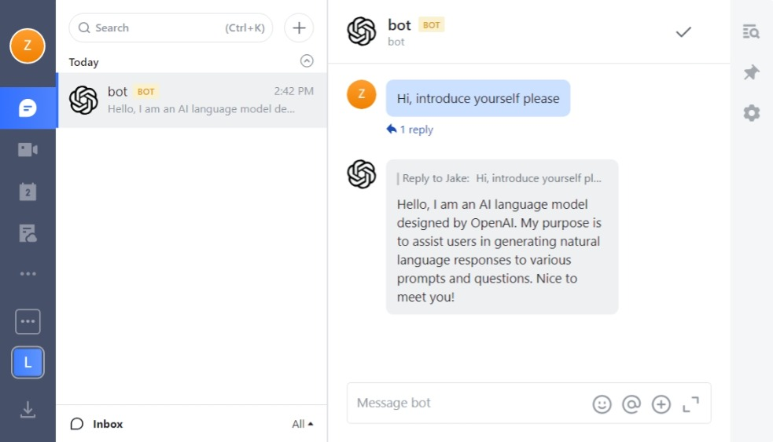
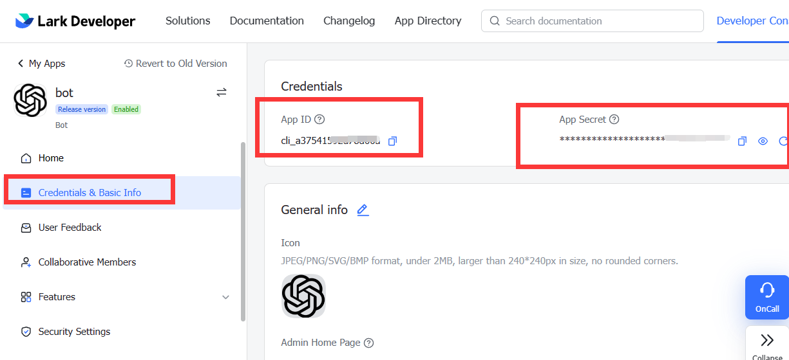
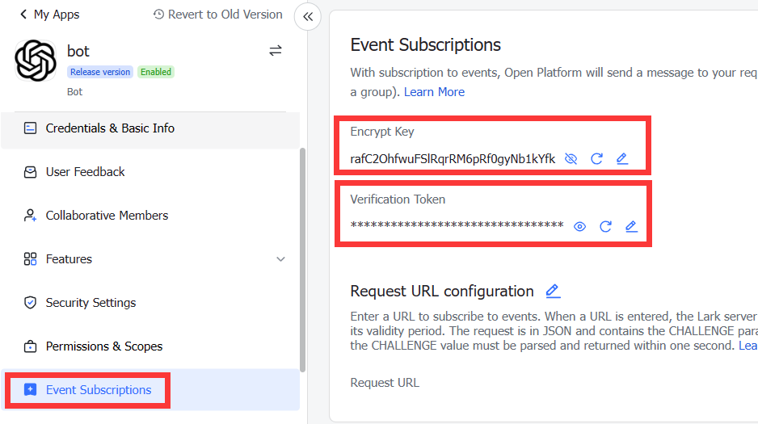

# ChatGPT Lark Bot

Your personal AI assistant in lark/feishu

## How to use

If you encounter any difficulties, feel free to make an issue and ask me.

1. Create your bot app in [Lark Open Platform](https://open.larksuite.com/app).
2. Get the`app_id`, `app_secret` in the **Credentials & Basic Info** page.

   

3. Get the `verification_token` and `event_encrypt_key` in the **Event Subscriptions** page.

   

4. [Click here](https://platform.openai.com/account/api-keys) to get your OpenAI key if you don't have.
5. Complete the configuration and run the bot. (see below)
6. Go to the **Event Subscriptions** page to configure the Request URL (`http(s)://host:port/webhook/event`).
   Add `Message received` event in the Events added part.
7. Enable bot in **Features**. Add the following scopes to the bot in the **Permissions & Scopes** page.
   im:message.group_msg:readonly
   im:message.p2p_msg:readonly
   im:message:send_as_bot
8. Release your bot in the **Version Management & Release** page.
9. Enjoy! Welcome star if like it😄

### Run the bot on Repl

Free, no server needed, but maybe unstable

1. Click the badge below to create your own repl.

   

2. Add the following config in Tools->Secrets.
    - APP_ID
    - APP_SECRET
    - VERIFICATION_TOKEN
    - EVENT_ENCRYPT_KEY
    - OPEN_AI_KEY
    - BOT_NAME
3. Click Run in your repl, and copy the url(your repl host) in webview window. Your request URL is this URL plus `/webhook/event`.

### Run the bot locally or on your server

1. Download the file corresponding to your OS in the [releases page](https://github.com/jakezhu9/chatgpt-lark-bot/releases).
2. After you download the file, extract into a folder and rename `config_example.yaml` to `config.yaml` and complete it.
3. Run the bot.
   (If you don't have public network, you may need a reverse proxy tool such as ngrok for event subscription)

## License

This repository is licensed under the [MIT License](LICENSE).